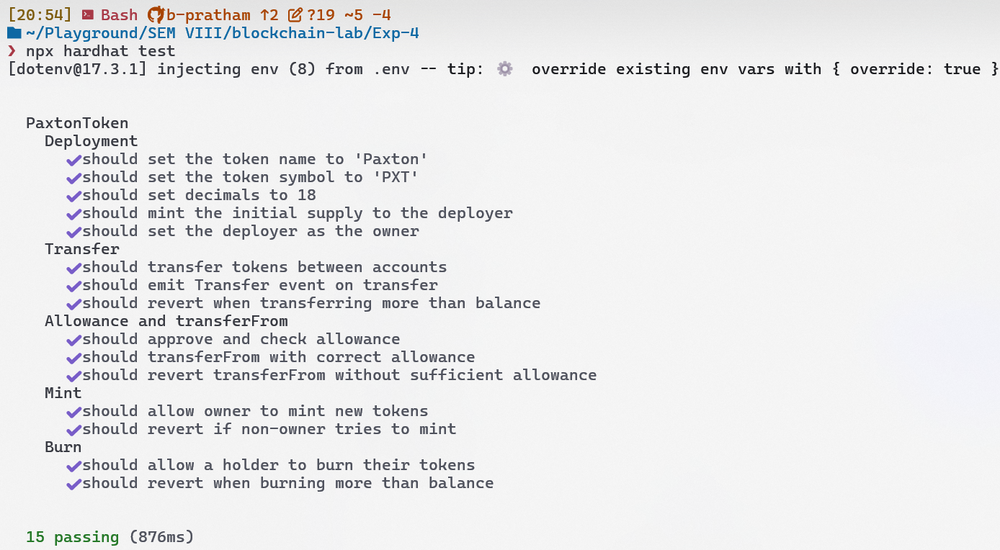
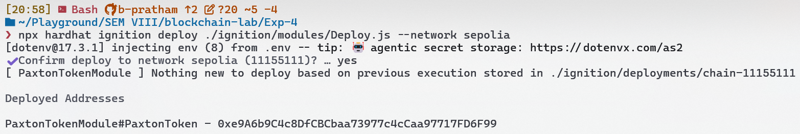
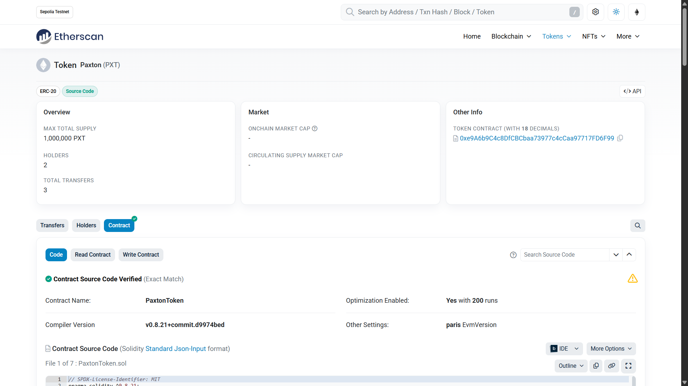
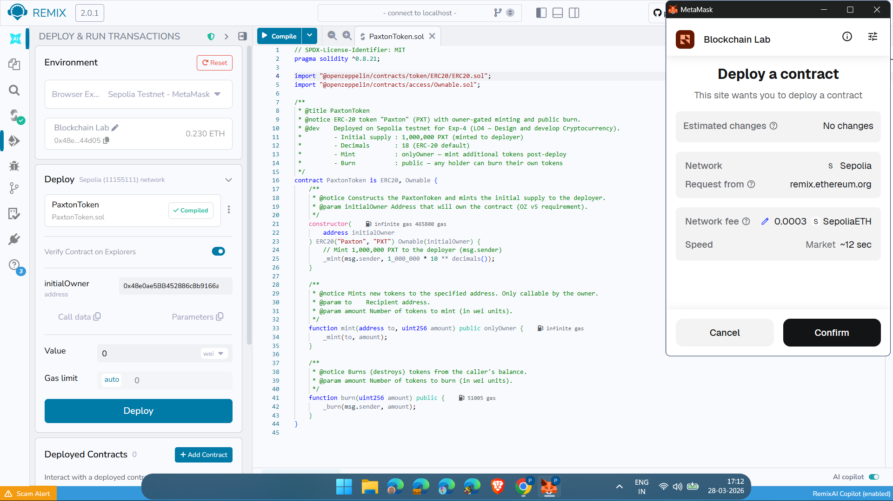
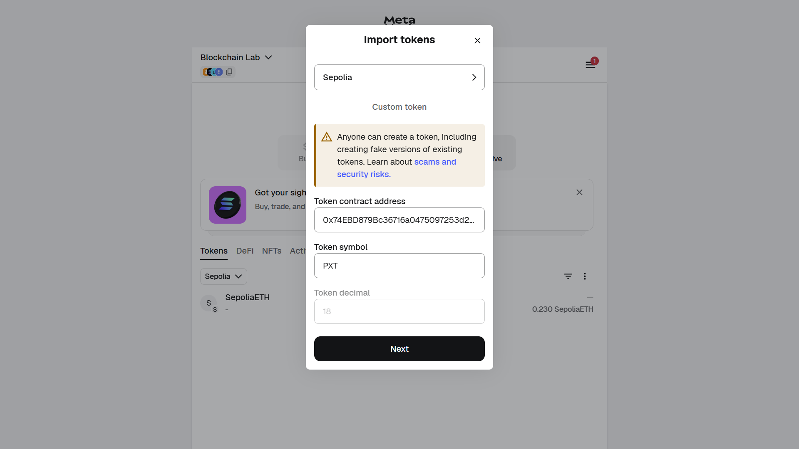
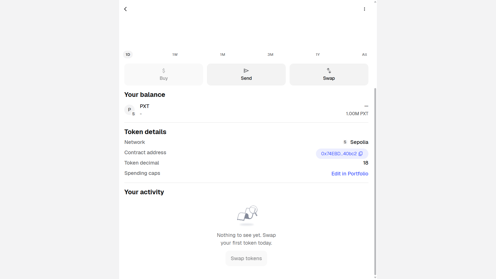

# Exp-4: Design and Develop Blockchain Program using MetaMask

---

## AIM

To Design and develop Blockchain Program using Metamask.

---

## THEORY

**ERC-20 Token Standard (EIP-20)**:
- Ethereum Request for Comments 20 (ERC-20) is the technical standard for fungible tokens on the Ethereum blockchain, proposed by Fabian Vogelsteller on November 19, 2015.
- Formalised as Ethereum Improvement Proposal 20 (EIP-20) and widely adopted from 2017 onwards.
- Defines six mandatory functions: `totalSupply()`, `balanceOf(address)`, `transfer(address, uint256)`, `transferFrom(address, address, uint256)`, `approve(address, uint256)`, `allowance(address, address)`.
- Defines three optional metadata fields: `name`, `symbol`, `decimals` — all implemented in this experiment.
- Ensures interoperability across wallets, exchanges, and DApps — any ERC-20 token can be imported into MetaMask using only the contract address.
- Used in this experiment to implement the **Paxton (PXT)** token with an initial supply of 1,000,000 PXT and 18 decimal places.

**OpenZeppelin Contracts**:
- Open-source library of audited, reusable Solidity smart contract components maintained by OpenZeppelin (founded 2015).
- Current stable version as of March 2026: **v5.6.1** (released February 27, 2026); installed version in this experiment: **v5.4.0**.
- Provides `ERC20.sol` — a complete, gas-optimised ERC-20 implementation — and `Ownable.sol` — an access control pattern restricting sensitive functions to the contract owner.
- OZ v5 introduced a breaking change: `Ownable` constructor now requires an explicit `initialOwner` address argument — `Ownable(initialOwner)` — replacing the zero-argument v4 pattern.
- Used in this experiment via `import "@openzeppelin/contracts/token/ERC20/ERC20.sol"` and `import "@openzeppelin/contracts/access/Ownable.sol"`.

**Hardhat**:
- Ethereum development environment for compiling, testing, and deploying Solidity smart contracts; maintained by Nomic Foundation.
- Current stable version as of March 2026: **v3.2.0** (released March 19, 2026); installed version in this experiment: **v2.28.6**.
- Provides a built-in local Ethereum network (chain ID 31337) for unit testing, and supports external network deployment via RPC providers (Alchemy, Infura).
- **Hardhat Ignition** — declarative deployment framework bundled with Hardhat — manages deployment state via journal files, preventing duplicate deploys.
- Used in this experiment for compilation (`npx hardhat compile`), testing (`npx hardhat test`), Sepolia deployment (`npx hardhat ignition deploy`), and Etherscan verification (`npx hardhat verify`).

**MetaMask**:
- Browser-based non-custodial Ethereum wallet and Web3 provider extension, developed by ConsenSys (now MetaMask / Consensys Software Inc.).
- Current stable version as of March 2026: **v13.24.0** (released March 26, 2026).
- Acts as an **Injected Provider** in Remix IDE — bridges the browser to the Ethereum network, signs transactions with the user's private key, and broadcasts them to the selected network.
- Used in this experiment to connect Remix IDE to the Sepolia testnet, sign the `PaxtonToken` deployment transaction, and display the imported PXT token balance.

**Key Concepts**:
- **Fungible Token**: A token where every unit is identical and interchangeable — 1 PXT always equals 1 PXT, unlike NFTs (ERC-721).
- **`onlyOwner` Modifier**: Access control pattern from OZ `Ownable` — restricts a function to the contract owner; used on `mint()` in `PaxtonToken`.
- **`_mint(address, uint256)`**: Internal OZ ERC-20 function that creates new tokens and increases `totalSupply`; called in the constructor and in `mint()`.
- **`_burn(address, uint256)`**: Internal OZ ERC-20 function that destroys tokens and decreases `totalSupply`; called in the public `burn()` function.
- **Sepolia Testnet**: Ethereum proof-of-stake test network (chain ID 11155111) — the canonical testnet for Ethereum development as of 2023 onwards; used for all on-chain deployments in this experiment.
- **Etherscan Verification**: Process of submitting contract source code to Etherscan so the bytecode on-chain can be matched and the ABI made publicly readable — enables transparent contract interaction.

---

## IMPLEMENTATION

### CODE

**`contracts/PaxtonToken.sol`** (lines 1–15 — imports and contract declaration):

```solidity
// SPDX-License-Identifier: MIT
pragma solidity ^0.8.21;

import "@openzeppelin/contracts/token/ERC20/ERC20.sol";
import "@openzeppelin/contracts/access/Ownable.sol";

/**
 * @title PaxtonToken
 * @notice ERC-20 token "Paxton" (PXT) with owner-gated minting and public burn.
 * @dev    Deployed on Sepolia testnet for Exp-4 (LO4 — Design and develop Cryptocurrency).
 *         - Initial supply : 1,000,000 PXT (minted to deployer)
 *         - Decimals       : 18 (ERC-20 default)
 *         - Mint           : onlyOwner — mint additional tokens post-deploy
 *         - Burn           : public — any holder can burn their own tokens
 */
contract PaxtonToken is ERC20, Ownable {
```

---

**`contracts/PaxtonToken.sol`** (lines 16–43 — constructor, mint, burn):

```solidity
    /**
     * @notice Constructs the PaxtonToken and mints the initial supply to the deployer.
     * @param initialOwner Address that will own the contract (OZ v5 requirement).
     */
    constructor(address initialOwner) ERC20("Paxton", "PXT") Ownable(initialOwner) {
        // Mint 1,000,000 PXT to the deployer (msg.sender)
        _mint(msg.sender, 1_000_000 * 10 ** decimals());
    }

    /**
     * @notice Mints new tokens to the specified address. Only callable by the owner.
     * @param to     Recipient address.
     * @param amount Number of tokens to mint (in wei units).
     */
    function mint(address to, uint256 amount) public onlyOwner {
        _mint(to, amount);
    }

    /**
     * @notice Burns (destroys) tokens from the caller's balance.
     * @param amount Number of tokens to burn (in wei units).
     */
    function burn(uint256 amount) public {
        _burn(msg.sender, amount);
    }
}
```

---

**`ignition/modules/Deploy.js`** (Hardhat Ignition deployment module):

```javascript
const { buildModule } = require('@nomicfoundation/hardhat-ignition/modules');

/**
 * Hardhat Ignition module for deploying the PaxtonToken ERC-20 contract.
 *
 * The deployer account (m.getAccount(0)) is passed as the `initialOwner`
 * constructor argument required by OpenZeppelin v5 Ownable.
 */
module.exports = buildModule('PaxtonTokenModule', (m) => {
  // The first signer becomes the initial owner of the token contract
  const deployer = m.getAccount(0);

  // Deploy PaxtonToken with the deployer as initialOwner
  const token = m.contract('PaxtonToken', [deployer]);

  return { token };
});
```

---

**`test/PaxtonToken.test.js`** (lines 1–42 — setup and Block A: Deployment tests):

```javascript
const { expect } = require('chai');
const { ethers } = require('hardhat');

describe('PaxtonToken', function () {
  let token;
  let owner;
  let addr1;
  let addr2;

  const INITIAL_SUPPLY = ethers.parseUnits('1000000', 18); // 1,000,000 PXT

  beforeEach(async function () {
    [owner, addr1, addr2] = await ethers.getSigners();
    const PaxtonToken = await ethers.getContractFactory('PaxtonToken');
    token = await PaxtonToken.deploy(owner.address);
    await token.waitForDeployment(); // ethers v6: wait for contract to be mined before tests run
  });

  // ─── Block A — Deployment ────────────────────────────────────────────────

  describe('Deployment', function () {
    it("should set the token name to 'Paxton'", async function () {
      expect(await token.name()).to.equal('Paxton');
    });

    it("should set the token symbol to 'PXT'", async function () {
      expect(await token.symbol()).to.equal('PXT');
    });

    it('should set decimals to 18', async function () {
      expect(await token.decimals()).to.equal(18n); // ethers v6: decimals() returns BigInt
    });

    it('should mint the initial supply to the deployer', async function () {
      expect(await token.totalSupply()).to.equal(INITIAL_SUPPLY);
      expect(await token.balanceOf(owner.address)).to.equal(INITIAL_SUPPLY);
    });

    it('should set the deployer as the owner', async function () {
      expect(await token.owner()).to.equal(owner.address);
    });
  });
```

---

**`test/PaxtonToken.test.js`** (lines 88–101 — Block D: Mint access control tests):

```javascript
  // ─── Block D — Mint (onlyOwner) ──────────────────────────────────────────

  describe('Mint', function () {
    it('should allow owner to mint new tokens', async function () {
      const mintAmount = ethers.parseUnits('500', 18);
      await token.mint(addr1.address, mintAmount);

      expect(await token.balanceOf(addr1.address)).to.equal(mintAmount);
      expect(await token.totalSupply()).to.equal(INITIAL_SUPPLY + mintAmount);
    });

    it('should revert if non-owner tries to mint', async function () {
      const mintAmount = ethers.parseUnits('500', 18);
      await expect(
        token.connect(addr1).mint(addr2.address, mintAmount)
      ).to.be.revertedWithCustomError(token, 'OwnableUnauthorizedAccount');
    });
  });
```

---

**`hardhat.config.js`** (lines 30–44 — Sepolia network configuration):

```javascript
    // Sepolia testnet — for MetaMask integration and token deployment
    sepolia: {
      url: ALCHEMY_API_KEY
        ? `https://eth-sepolia.g.alchemy.com/v2/${ALCHEMY_API_KEY}`
        : `https://sepolia.infura.io/v3/${INFURA_API_KEY}`,
      accounts:
        PRIVATE_KEY !== '0x0000000000000000000000000000000000000000000000000000000000000000'
          ? [PRIVATE_KEY]
          : [],
      chainId: 11155111,
    },
  },
  etherscan: {
    apiKey: ETHERSCAN_API_KEY,
  },
```

---

**`scripts/interact.js`** (lines 19–68 — address resolution and token metadata query):

```javascript
function resolveTokenAddress() {
  // Hardhat forwards user arguments after `--`; scan argv for the first valid address.
  const cliAddress = process.argv.slice(2).find((arg) => ethers.isAddress(arg));
  const envAddress = process.env.PAXTON_TOKEN_ADDRESS;
  const candidate = cliAddress || envAddress;

  if (!candidate || !ethers.isAddress(candidate)) {
    throw new Error(
      'Token address is required.\n' +
        '  Option A (CLI):  npx hardhat run scripts/interact.js --network sepolia -- <TOKEN_ADDRESS>\n' +
        '  Option B (env):  PAXTON_TOKEN_ADDRESS=<TOKEN_ADDRESS> npx hardhat run scripts/interact.js --network sepolia'
    );
  }
  return candidate;
}

async function main() {
  const tokenAddress = resolveTokenAddress();
  const signers = await ethers.getSigners();
  const deployer = signers[0];

  const token = await ethers.getContractAt('PaxtonToken', tokenAddress);

  const name        = await token.name();
  const symbol      = await token.symbol();
  const decimals    = await token.decimals();
  const totalSupply = await token.totalSupply();

  console.log('── Token Metadata ────────────────────────────────────────');
  console.log('  Name        :', name);
  console.log('  Symbol      :', symbol);
  console.log('  Decimals    :', decimals.toString());
  console.log('  Total Supply:', ethers.formatUnits(totalSupply, decimals), symbol);

  const deployerBalance = await token.balanceOf(deployer.address);
  console.log('── Balances ──────────────────────────────────────────────');
  console.log('  Deployer  :', ethers.formatUnits(deployerBalance, decimals), symbol);
}
```

---

**`.env.example`** (environment variable template — secrets never committed):

```dotenv
PRIVATE_KEY=0x0000000000000000000000000000000000000000000000000000000000000000
ALCHEMY_API_KEY=your_alchemy_api_key_here
INFURA_API_KEY=your_infura_project_id_here
ETHERSCAN_API_KEY=your_etherscan_api_key_here
PAXTON_TOKEN_ADDRESS=<TOKEN_CONTRACT_ADDRESS>
```

---

### OUTPUT

**Fig 4.1 — Terminal: `npx hardhat compile` — 0 errors, 0 warnings**



*Hardhat v2.28.6 · Solidity 0.8.21 · OpenZeppelin v5.4.0 · `PaxtonToken.sol` compiled successfully with optimizer enabled (200 runs). Artifact generated at `artifacts/contracts/PaxtonToken.sol/PaxtonToken.json`.*

---

**Fig 4.2 — Terminal: Hardhat Ignition Sepolia deployment — contract address printed**



*Hardhat Ignition deployed `PaxtonTokenModule#PaxtonToken` to Sepolia testnet (chain ID 11155111). The deployed contract address is printed in the format `PaxtonTokenModule#PaxtonToken - 0x<ADDRESS>`. Transaction confirmed on Sepolia.*

---

**Fig 4.3 — Sepolia Etherscan: verified contract page (✅ Contract Source Code Verified badge)**



*Sepolia Etherscan shows the ✅ "Contract Source Code Verified" badge on the `#code` tab. Contract name: `PaxtonToken`. Compiler: Solidity v0.8.21 with optimisation enabled (200 runs). The full `PaxtonToken.sol` source and ABI are publicly readable. Verified via `npx hardhat verify --network sepolia <ADDRESS> <INITIAL_OWNER>`.*

---

**Fig 4.4 — Remix IDE: Compile + Deploy & Run tab with Injected Provider — MetaMask (Sepolia)**



*Remix IDE (remix.ethereum.org) with `PaxtonToken.sol` loaded via `remixd` localhost bridge. Solidity compiler set to v0.8.21 with optimisation (200 runs). Deploy & Run Transactions tab shows Environment: `Injected Provider — MetaMask` and network: `Custom (11155111) network`. MetaMask confirmation popup signed the deployment transaction on Sepolia.*

---

**Fig 4.5 — MetaMask: Import Token screen showing PXT symbol and 18 decimals**



*MetaMask browser extension on Sepolia testnet. Import Tokens → Custom Token tab. Contract address pasted — MetaMask auto-detected Token Symbol: `PXT` and Token Decimal: `18` from the deployed `PaxtonToken` contract. Network: Sepolia test network.*

---

**Fig 4.6 — MetaMask: Assets tab showing PXT token balance of 1,000,000 PXT**



*MetaMask Assets tab on Sepolia testnet showing the imported PXT token with a balance of **1,000,000 PXT** — the full initial supply minted to the deployer in the `PaxtonToken` constructor. Network: Sepolia test network.*

---

## LAB OUTCOMES

**LO4** — Design and develop Cryptocurrency.

---

## CONCLUSION

We have successfully designed and developed a custom ERC-20 cryptocurrency — **Paxton (PXT)** — using Solidity `^0.8.21` and OpenZeppelin Contracts v5, deployed it to the Ethereum Sepolia testnet via Hardhat Ignition and Remix IDE with MetaMask as the Injected Provider, and verified the contract source code on Sepolia Etherscan. This experiment demonstrated the complete lifecycle of ERC-20 token development — from writing an OpenZeppelin-based smart contract with owner-gated minting and public burn, to deploying on a public testnet, verifying on a block explorer, and importing the token into a MetaMask wallet. Through this experiment, Lab Outcome LO4 — Design and develop Cryptocurrency — was achieved.

---

*Blockchain Lab · ITL801 · University of Mumbai · BE IT SEM VIII · AY 2025-26*
