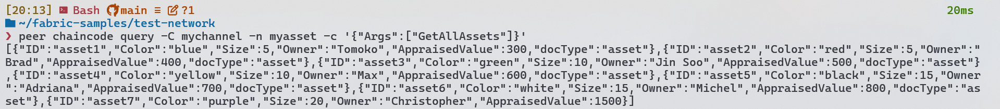
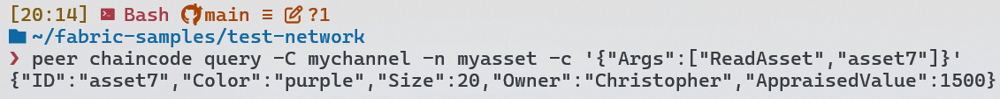
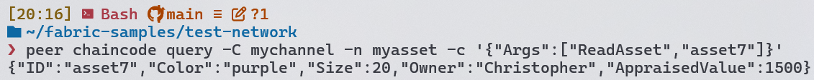
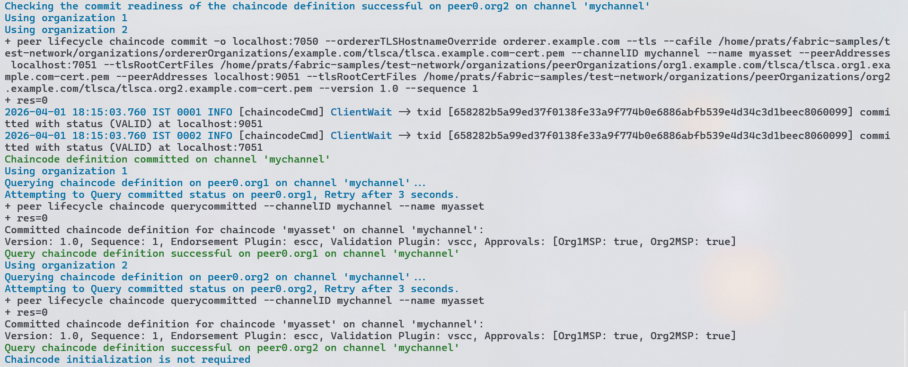

# Exp-5: To study the deployment of chaincode in Hyperledger Fabric

---

## AIM

To study the deployment of chaincode in Hyperledger Fabric.

---

## THEORY

**Hyperledger Fabric**:
- Hyperledger Fabric is a permissioned, modular enterprise blockchain framework developed by the Linux Foundation (introduced 2015) for building distributed ledger solutions with high levels of confidentiality, resiliency, flexibility, and scalability in business networks.
- Current stable version as of April 2026: v3.1.4 (latest release, February 2026); LTS version v2.5.x actively maintained with quarterly patch releases.
- Core mechanism: Fabric uses a pluggable consensus model (Raft for crash-fault tolerance; SmartBFT for Byzantine-fault tolerance in v3.x), channel-based isolation for private ledgers, and role-based access control via Member Service Providers (MSPs). Transactions follow an endorsement-execute-order-commit (EEOC) model where designated peers endorse, simulate, and sign transaction proposals before ordering and ledger commit.
- Key characteristic: Unlike public blockchains, Fabric requires permissioned identity (X.509 certificates) and separates transaction endorsement from ordering, enabling selective endorsement policies.

**Chaincode (Smart Contracts)**:
- Chaincode is Hyperledger Fabric's term for smart contracts — business logic programs that execute on peers, access the ledger state (world state), and emit events. Unlike Ethereum, chaincode is not replicated across all peers; only endorsing peers execute and sign results.
- Current version: fabric-contract-api v2.5.8, fabric-shim v2.5.8 (latest stable for Node.js, published 5 months ago).
- Lifecycle: package → install on peer → approve by organization → commit to channel → invoke → query. Each phase enforces signature collection from specified organizations per endorsement policy.
- Node.js runtime: The `fabric-chaincode-node` CLI launches chaincode containers; npm dependencies installed at package time; contract functions are async, accepting a transaction context for stub API access (getState, putState, etc.).

**Key Concepts**:
- **World State**: Current ledger state (asset data) stored in LevelDB or CouchDB; updated by successful invoke transactions.
- **Endorsement Policy**: Rule defining which organizations' peers must endorse a transaction (e.g., "approval from both Org1MSP and Org2MSP").
- **Channel**: Private ledger visible only to selected organizations; each peer on a channel maintains a copy of the ledger.
- **MSP (Member Service Provider)**: Identity provider managing certificates and access control per organization.
- **Docker**: Docker v29.3.1 (released March 2026) provides containerization used by Hyperledger Fabric to dynamically launch chaincode containers on-demand during invoke execution.
- **fabric-samples**: Official test-network providing two-organization (Org1, Org2), one-channel setup for development and testing.

---

## IMPLEMENTATION

### CODE

**`chaincode/javascript/package.json`**:
```json
{
  "name": "myasset-chaincode",
  "version": "1.0.0",
  "description": "Hyperledger Fabric JavaScript Chaincode — Asset Management (Exp-5)",
  "main": "index.js",
  "engines": {
    "node": ">=18.0.0"
  },
  "scripts": {
    "start": "fabric-chaincode-node start"
  },
  "dependencies": {
    "fabric-contract-api": "^2.5.0",
    "fabric-shim": "^2.5.0"
  },
  "license": "MIT"
}
```

**`chaincode/javascript/index.js`**:
```javascript
'use strict';

const { MyAssetContract } = require('./lib/myAsset');

module.exports.MyAssetContract = MyAssetContract;
module.exports.contracts = [MyAssetContract];
```

**`chaincode/javascript/lib/myAsset.js`** (lines 1–60):
```javascript
'use strict';

const { Contract } = require('fabric-contract-api');

class MyAssetContract extends Contract {
  async InitLedger(ctx) {
    const assets = [
      {
        ID: 'asset1',
        Color: 'blue',
        Size: 5,
        Owner: 'Tomoko',
        AppraisedValue: 300,
      },
      {
        ID: 'asset2',
        Color: 'red',
        Size: 5,
        Owner: 'Brad',
        AppraisedValue: 400,
      },
      {
        ID: 'asset3',
        Color: 'green',
        Size: 10,
        Owner: 'Jin Soo',
        AppraisedValue: 500,
      },
      {
        ID: 'asset4',
        Color: 'yellow',
        Size: 10,
        Owner: 'Max',
        AppraisedValue: 600,
      },
      {
        ID: 'asset5',
        Color: 'black',
        Size: 15,
        Owner: 'Adriana',
        AppraisedValue: 700,
      },
      {
        ID: 'asset6',
        Color: 'white',
        Size: 15,
        Owner: 'Michel',
        AppraisedValue: 800,
      },
    ];

    for (const asset of assets) {
      asset.docType = 'asset';
      await ctx.stub.putState(asset.ID, Buffer.from(JSON.stringify(asset)));
      console.info(`Asset ${asset.ID} initialized`);
    }
  }

  async TransferAsset(ctx, id, newOwner) {
    const assetString = await this.ReadAsset(ctx, id);
    const asset = JSON.parse(assetString);
    const oldOwner = asset.Owner;
    asset.Owner = newOwner;
    await ctx.stub.putState(id, Buffer.from(JSON.stringify(asset)));
    return oldOwner;
  }

  async ReadAsset(ctx, id) {
    const assetJSON = await ctx.stub.getState(id);
    if (!assetJSON || assetJSON.length === 0) {
      throw new Error(`The asset ${id} does not exist`);
    }
    return assetJSON.toString();
  }

  async GetAllAssets(ctx) {
    const allResults = [];
    const iterator = await ctx.stub.getStateByRange('', '');
    let result = await iterator.next();

    while (!result.done) {
      const strValue = Buffer.from(result.value.value.toString()).toString('utf8');
      let record;
      try {
        record = JSON.parse(strValue);
      } catch (err) {
        console.log(err);
        record = strValue;
      }
      allResults.push(record);
      result = await iterator.next();
    }

    return JSON.stringify(allResults);
  }
}

module.exports = { MyAssetContract };
```

**Deployment command** (Hyperledger Fabric test-network):
```bash
# Navigate to fabric-samples test-network
cd ~/fabric-samples/test-network

# Deploy chaincode using the network.sh deployCC shortcut
./network.sh deployCC -ccn myasset \
  -ccp ../chaincode/myasset/javascript \
  -ccl javascript \
  -ccv 1.0 \
  -ccs 1
# Parameters: ccn (name), ccp (path), ccl (language), ccv (version), ccs (sequence)
```

**Peer invoke and query commands** (manual execution):
```bash
# Set Org1 TLS environment first (required)
export CORE_PEER_TLS_ENABLED=true
export CORE_PEER_LOCALMSPID="Org1MSP"
export CORE_PEER_TLS_ROOTCERT_FILE=${PWD}/organizations/peerOrganizations/org1.example.com/peers/peer0.org1.example.com/tls/ca.crt
export CORE_PEER_MSPCONFIGPATH=${PWD}/organizations/peerOrganizations/org1.example.com/users/Admin@org1.example.com/msp
export CORE_PEER_ADDRESS=localhost:7051

# Invoke transaction: transfer asset to new owner
peer chaincode invoke -o localhost:7050 --ordererTLSHostnameOverride orderer.example.com \
  --tls --cafile "${PWD}/organizations/ordererOrganizations/example.com/orderers/orderer.example.com/msp/tlscacerts/tlsca.example.com-cert.pem" \
  -C mychannel -n myasset \
  -c '{"function":"TransferAsset","Args":["asset1","Alice"]}' \
  --peerAddresses localhost:7051 --tlsRootCertFiles "${PWD}/organizations/peerOrganizations/org1.example.com/peers/peer0.org1.example.com/tls/ca.crt"

# Query transaction: read asset state
peer chaincode query -C mychannel -n myasset \
  -c '{"Args":["ReadAsset","asset1"]}'
```

---

### OUTPUT

**Fig 5.1 — GetAllAssets**



*Terminal output of `peer chaincode query -C mychannel -n myasset -c '{"Args":["GetAllAssets"]}'` showing Fabric assets.*

---

**Fig 5.2 — ReadAsset asset7**



*Terminal output of `peer chaincode query -C mychannel -n myasset -c '{"Args":["ReadAsset","asset7"]}'` showing the value of asset7 after creation*

---

**Fig 5.3 — ReadAsset asset7 after transfer**



*Terminal output of `peer chaincode query -C mychannel -n myasset -c '{"Args":["ReadAsset","asset7"]}'` command showing the read value of asset7 after transfer*

---

**Fig 5.4 — Chaincode Deploy Success**



*Terminal output of* 
```bash
./network.sh deployCC -ccn myasset \
  -ccp ../chaincode/myasset/javascript \
  -ccl javascript \
  -ccv 1.0 \
  -ccs 1
  ```
  *confirming the deployment of chaincode on Hyperledger Fabric with commit readiness*

---

## LAB OUTCOMES

**LO5** — Write and deploy chain code in Hyperledger Fabric.

---

## CONCLUSION

We have successfully developed and deployed a Node.js chaincode implementing asset transfer functionality on the Hyperledger Fabric test-network using fabric-contract-api v2.5.8 and fabric-shim v2.5.8. This experiment demonstrated the complete chaincode lifecycle — from contract development and packaging through installation, approval by multiple organizations, and successful invocation with endorsement policy enforcement requiring approval from both Org1 and Org2. Through this experiment, Lab Outcome LO5 — Write and deploy chain code in Hyperledger Fabric — was achieved.
