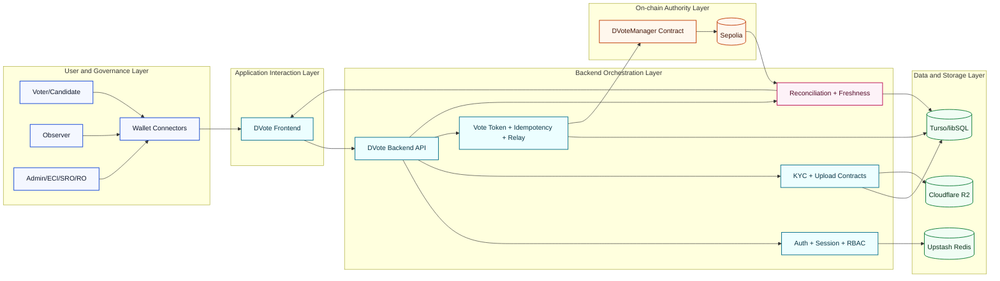
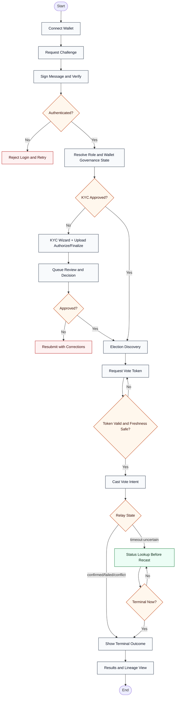

# MINI PROJECT REPORT

## DVote: Decentralized Voting System (MVP)

**Course**: Blockchain Lab (ITL801)  
**Program**: B.E. Information Technology, Semester VIII  
**University**: University of Mumbai  
**Experiment**: Exp-6 Mini Project

---

## Table of Contents

| Chapter | Topic | Page No. |
|---|---|---|
|  | Abstract | TBA |
|  | List of Figures | TBA |
|  | List of Tables | TBA |
|  | List of Abbreviations | TBA |
| **Chapter 1** | **Introduction** | TBA |
|  | 1.1 Literature Survey | TBA |
|  | 1.2 Problem Definition | TBA |
|  | 1.3 Objectives | TBA |
|  | 1.4 Proposed Solution | TBA |
|  | 1.5 Technology Used | TBA |
| **Chapter 2** | **System Design and Methodology** | TBA |
|  | 2.1 Block Diagram | TBA |
|  | 2.2 Flow Chart | TBA |
|  | 2.3 Software Requirements | TBA |
|  | 2.4 Cost Estimation | TBA |
|  | 2.5 Threat Model | TBA |
| **Chapter 3** | **Results and Descriptions** | TBA |
|  | 3.1 Implementation Snapshot | TBA |
|  | 3.2 Figures with Explanation | TBA |
|  | 3.3 Code Blocks with Explanation | TBA |
|  | 3.4 Future Scope | TBA |
| **Chapter 4** | **Conclusion** | TBA |
| **Chapter 5** | **References** | TBA |
|  | Appendix A - Deployment Artifacts | TBA |

---

## Abstract

Public trust in electoral systems depends on transparent process control, auditable records, and resistance to manipulation. Conventional digital and paper-assisted election workflows often rely on centralized control points, causing social trust gaps in identity verification, vote integrity, and result publication. DVote addresses this trust challenge through a blockchain-centered architecture that combines on-chain finality with role-governed off-chain orchestration. 

In this mini project, the core smart contract layer and backend service layer are implemented and completion-locked for MVP scope, while frontend scope is under active incremental development. The system uses wallet-authenticated session flow, KYC-driven eligibility controls, one-time vote token and idempotency contracts, immutable escalation policy for rerun governance, and freshness-aware operational safeguards. The design emphasizes social trust impact by ensuring that election state transitions, finalization outcomes, and rerun lineage remain verifiable and policy-consistent across modules. This report presents the design rationale, methodology, implementation evidence, key code contracts, and future expansion roadmap for production-grade hardening. [1][2][4][5][9][10]

---

## List of Figures

| Figure No. | Title | Section | Page No. |
|---|---|---|---|
| Figure 2.1 | Consolidated DVote Architecture (Mermaid) | 2.1 | TBA |
| Figure 2.2 | Consolidated DVote Architecture (ASCII) | 2.1 | TBA |
| Figure 2.3 | End-to-End Operational Flow (Mermaid) | 2.2 | TBA |
| Figure 2.4 | End-to-End Operational Flow (ASCII) | 2.2 | TBA |
| Figure 3.1 | Foundry Test and Deployment Evidence (Placeholder) | 3.2 | TBA |
| Figure 3.2 | Backend Smoke and Health Evidence (Placeholder) | 3.2 | TBA |
| Figure 3.3 | Integrated Auth and Vote Workflow Evidence (Placeholder) | 3.2 | TBA |

## List of Tables

| Table No. | Title | Section | Page No. |
|---|---|---|---|
| Table 1.1 | Ethereum vs Hyperledger Short Comparison | 1.1 | TBA |
| Table 1.2 | Technology Used | 1.5 | TBA |
| Table 2.1 | Software Requirements | 2.3 | TBA |
| Table 2.2 | Cost Estimation (INR and USD) | 2.4 | TBA |
| Table 2.3 | Threat Model | 2.5 | TBA |
| Table 3.1 | Implementation Snapshot | 3.1 | TBA |
| Table A.1 | Deployment Artifacts | Appendix A | TBA |

## List of Abbreviations

| Abbreviation | Expanded Form |
|---|---|
| API | Application Programming Interface |
| CSRF | Cross-Site Request Forgery |
| DApp | Decentralized Application |
| ECI | Election Commission of India |
| EIP | Ethereum Improvement Proposal |
| EOA | Externally Owned Account |
| FCFS | First Come First Serve |
| JWT | JSON Web Token |
| KYC | Know Your Customer |
| MVP | Minimum Viable Product |
| RBAC | Role-Based Access Control |
| SLA | Service Level Agreement |
| TTL | Time To Live |
| UI | User Interface |
| UX | User Experience |

---

# Chapter 1: Introduction

## 1.1 Literature Survey

Blockchain voting literature consistently prioritizes transparency, tamper-evidence, and distributed trust, while also identifying practical concerns in scalability, privacy, and governance operations. Survey-oriented work highlights that blockchain can reduce unilateral manipulation risk compared to centralized systems, but real deployment quality depends heavily on role models, verification pipelines, and failure handling. [19]

For this project, design choices were guided by three classes of references:
1. Official Ethereum ecosystem and testnet guidance for realistic deployment parity in an EVM environment. [11]
2. Foundry/OpenZeppelin implementation references for secure role and signature validation contracts. [12][13]
3. Hyperledger documentation for a comparative understanding of permissioned enterprise patterns. [18]

### Short Comparison: Ethereum vs Hyperledger

| Dimension | Ethereum (Public EVM Model) | Hyperledger Fabric (Permissioned Model) |
|---|---|---|
| Participation model | Open/public network | Permissioned membership via MSP |
| Consensus posture | Public-chain economics and global validation | Enterprise-governed modular architecture |
| Smart contract style | Solidity on EVM | Chaincode in general-purpose languages |
| Transparency profile | Strong public auditability | Controlled visibility with channel-level isolation |
| Suitability in this project | Chosen for trust-through-public-verifiability and existing EVM workflow | Used as comparative benchmark in academic framing |

This report therefore treats Ethereum as implementation target and Hyperledger as comparative context, not implementation scope. [11][18]

## 1.2 Problem Definition

The core problem is social trust deficiency in election workflows where users cannot independently verify process fairness end-to-end. Key risk vectors include:
1. Weakly auditable identity and eligibility transitions.
2. Replay and duplicate-action ambiguity in vote submission paths.
3. Inconsistent interpretation of election states and result finality across layers.
4. Governance opacity in rerun and escalation processes.

DVote addresses these by combining contract-enforced election state transitions with backend-enforced identity, session, and idempotency controls while preserving traceability for each critical action. [3][4][9][10]

## 1.3 Objectives

The mini project objectives are:
1. Establish a trust-centric election model where critical lifecycle transitions are deterministic and auditable.
2. Enforce one-wallet/one-vote behavior under KYC-gated eligibility in election scope.
3. Implement robust backend controls for session lifecycle, CSRF-safe refresh flow, and vote idempotency.
4. Support rerun governance with SLA tracking and role-separated escalation/execute responsibilities.
5. Maintain observer transparency without exposing identity-linked sensitive metadata.
6. Provide concise academic evidence of implementation maturity and clearly separate future scope.

## 1.4 Proposed Solution

DVote uses a hybrid architecture:
1. **Foundry on-chain layer**: authoritative election state machine, KYC attestation acceptance, vote casting constraints, and finalization outcomes.
2. **Backend off-chain layer**: wallet challenge authentication, role-aware APIs, encrypted KYC storage, upload finalize-bind contract, and relay/status orchestration.
3. **Frontend interaction layer**: role-routed UX and operational visibility (current progress ongoing).

Trust is anchored by two principles:
1. Chain finality is never overridden by off-chain convenience state.
2. Off-chain services add safety and usability but remain parity-bound to on-chain semantics.

## 1.5 Technology Used

| Layer | Primary Technologies | Purpose |
|---|---|---|
| Smart contracts | Solidity 0.8.x, Foundry (forge/anvil/cast), OpenZeppelin | Election lifecycle, role governance, signature verification, vote constraints |
| Backend | Node.js 22, Express 5, TypeScript, Prisma, Turso/libSQL | Auth/session, KYC domain logic, vote token/relay, reconciliation APIs |
| Cache/session | Upstash Redis | Session and short-lived contract state |
| Object storage | Cloudflare R2 (S3 compatible) | KYC media upload lifecycle |
| Deployment | Vercel (Node serverless + cron) | Hosted API and scheduled operational jobs |
| Chain runtime | Sepolia testnet | Public testnet deployment and parity checks |

Technology and deployment choices are aligned with official stack documentation and implementation references. [12][14][15][16][17][20]

---

# Chapter 2: System Design and Methodology

## 2.1 Block Diagram

### Figure 2.1: Consolidated DVote Architecture (Mermaid)



### Figure 2.2: Consolidated DVote Architecture (ASCII)

```text
----------------------------- USER / ROLE LAYER ------------------------------
[Voter/Candidate]   [Observer]   [Admin/ECI/SRO/RO]
				 \             |                /
									[Wallet Connectors]
													 |
-------------------------- APPLICATION LAYER ---------------------------------
										[DVote Frontend]
													 |
------------------------- BACKEND LAYER --------------------------------------
											[DVote Backend API]
					.-----------.-----------.------------.-----------.
					|           |           |            |           |
			 [Auth]      [KYC]      [Vote]    [Reconcile]   [Freshness]
					|           |           |            |           |
----------+-----------+-----------+------------+-----------+-------------------
					|           |           |            |
			[Redis]      [Turso]      [R2]      [Sepolia + DVoteManager]

Legend:
- Dots and splits represent policy-checked orchestration boundaries.
- On-chain finality remains canonical; backend/frontend consume parity state.
```

## 2.2 Flow Chart

### Figure 2.3: End-to-End Operational Flow (Mermaid)



### Figure 2.4: End-to-End Operational Flow (ASCII)

```text
[Start]
	 |
[Connect Wallet] --> [Challenge/Verify] --> {Authenticated?}
																					|No --> [Retry]
																					|Yes
																					v
														 [Role + Wallet Governance Check]
																					|
																	 {KYC Approved?}
														No --> [KYC + Upload + Review] --> {Approved?}
														Yes -------------------------------^ \
																															 No -> [Resubmit]
																					|
																	 [Election Discovery]
																					|
																	 [Request Vote Token]
																					|
														 {Token valid + freshness safe?}
															 No ------------------> [Retry Token]
															 Yes
																|
													 [Cast Vote Intent]
																|
														 {Relay State}
										confirmed/failed/conflict --> [Terminal Outcome]
										timeout-uncertain ---------> [Status Lookup Loop]
																									 |
																							{Terminal?}
																				 No ---^    Yes
																									 |
																						 [Results + Lineage]
																									 |
																								 [End]
```

## 2.3 Software Requirements

| Requirement Class | Minimum Requirement | Recommended Requirement |
|---|---|---|
| OS | Linux/WSL2/Windows/macOS | Linux or WSL2 for consistent CLI workflows |
| Runtime | Node.js 22.x, npm 10+ | Node.js 22.x LTS with isolated project environments |
| Smart contract tooling | Foundry (forge/anvil/cast), Solidity 0.8.x | Foundry latest stable + Sepolia RPC access |
| Backend stack | Express 5, TypeScript, Prisma | Express 5 with strict middleware hardening |
| Database/cache/storage | Turso/libSQL, Upstash Redis, Cloudflare R2 | Managed production-like instances for preview testing |
| Wallet and chain | MetaMask or EVM-compatible wallet, Sepolia chain | Dedicated role wallets for governance simulation |
| Deployment | Vercel projects (frontend/backend split) | Separate preview and production projects per layer |

## 2.4 Cost Estimation

**Estimation note**: INR and USD values are approximate academic planning values. Conversion assumption: **1 USD approx. INR 83**.

| Cost Head | Academic MVP (Monthly) | Extended Validation (Monthly) | Notes |
|---|---:|---:|---|
| Frontend hosting | INR 0 to INR 800 (USD 0 to USD 10) | INR 1,660 (USD 20) | Vercel plan dependent |
| Backend hosting | INR 0 to INR 800 (USD 0 to USD 10) | INR 1,660 (USD 20) | Vercel plan dependent |
| Database (Turso/libSQL) | INR 0 to INR 1,200 (USD 0 to USD 15) | INR 2,500 (USD 30) | Usage and replicas dependent |
| Cache (Upstash Redis) | INR 0 to INR 700 (USD 0 to USD 8) | INR 1,500 (USD 18) | Session and rate-limit volume dependent |
| Object storage (R2) | INR 0 to INR 700 (USD 0 to USD 8) | INR 1,200 (USD 14) | Storage and bandwidth dependent |
| DevOps/observability overhead | INR 0 to INR 400 (USD 0 to USD 5) | INR 1,000 (USD 12) | Optional tooling |
| **Estimated total** | **INR 0 to INR 4,600 (USD 0 to USD 56)** | **INR 9,520 (USD 114)** | Academic estimate only |

## 2.5 Threat Model

| Threat Category | Primary Risk | Mitigation in MVP | Residual Risk |
|---|---|---|---|
| Identity spoofing | Unauthorized election participation | Signed wallet auth + KYC validation pipeline + encrypted identity persistence | Depends on operational KYC reviewer quality |
| Vote replay/duplication | Multiple submissions for same intent | Vote token TTL + dedupe key + payload hash conflict handling | Network race can still yield timeout-uncertain states |
| State inconsistency | Frontend/backend drift from chain finality | Reconciliation service + parity enums + freshness state gating | Short stale windows possible under dependency lag |
| Governance abuse | Unauthorized rerun or role misuse | RBAC checks + immutable escalation ticket + ECI-only execute path | Requires secure key custody and role discipline |
| Data exposure | Sensitive KYC leakage in observer/admin pathways | Aggregate-only observer policy + encryption + controlled upload contract | Misconfigured logs can still create operational risk |

---

# Chapter 3: Results and Descriptions

## 3.1 Implementation Snapshot

| Workstream | Status at Report Time | Evidence Basis |
|---|---|---|
| Foundry smart contract scope | Completion locked | Foundry handoff report, test/build gates, Sepolia deployment evidence |
| Backend API/orchestration scope | Completion locked | Backend handoff report, test/smoke gates, preview deployment evidence |
| Frontend scope | In active progress | Frontend plan and walkthrough checkpoints |

Interpretation for evaluation: core trust-critical layers (on-chain and backend) are implementation-complete in MVP scope, enabling meaningful academic validation while UI layer is being iterated.

## 3.2 Figures with Explanation

**Figure 3.1 (Placeholder)** - Foundry test and deployment evidence panel  
This figure should include final terminal output for forge test pass matrix and Sepolia deployment verification snapshot.

**Figure 3.2 (Placeholder)** - Backend smoke and health evidence panel  
This figure should include local and preview smoke evidence, including protected endpoint responses and freshness endpoint success.

**Figure 3.3 (Placeholder)** - Integrated auth and vote workflow evidence panel  
This figure should include wallet login, role resolution, vote-token issue, and status lookup outcome screens.

Note: Placeholder-only treatment is intentionally used in this report iteration and can be replaced with validated screenshot artifacts in submission-hardening pass.

## 3.3 Code Blocks with Explanation

### Code Block 1: Finalization outcome contract (Foundry)

```solidity
enum FinalizationOutcome {
		CandidateWon,
		NotaTriggeredRerun,
		TieLotCandidateWon,
		TieLotNotaTriggeredRerun
}
```

This enum fixes the terminal result vocabulary used by downstream services. It prevents semantic ambiguity between normal candidate win and rerun-triggered outcomes.

### Code Block 2: Vote window and anti-replay checks (Foundry)

```solidity
if (nowTs < election.votingStart || nowTs >= election.votingEnd) {
		revert VoteWindowClosed(...);
}
if (!voter.isKycApproved) revert NotKycApproved(...);
if (voter.hasVoted) revert WalletAlreadyVoted(...);
if (voter.identityCommitment != commitment) {
		revert CommitmentMismatch(...);
}
if (commitmentUsed[electionId][commitment]) {
		revert CommitmentAlreadyUsed(...);
}
```

This path enforces strict temporal eligibility and commitment-bound uniqueness, reducing duplicate-vote and replay risk.

### Code Block 3: UUID v7 idempotency contract (Backend)

```typescript
const clientNonceSchema = z.uuidv7();

function buildDedupeKey(input: { wallet: string; electionId: string; clientNonce: string }): string {
	return `${input.wallet.toLowerCase()}:${input.electionId}:${input.clientNonce}`;
}

if (existing && existing.payloadHash !== payloadHash) {
	throw appError.conflict("Dedupe key already exists with different payload");
}
```

This logic ensures retries remain safe and deterministic: same intent can be reused, but payload mutation under same dedupe identity is blocked.

### Code Block 4: Freshness-state derivation contract (Backend)

```typescript
if (!lastSyncedAt) return degraded;
if (ageSec <= freshnessFreshMaxSec) return fresh;
if (ageSec <= freshnessStaleMaxSec) return stale;
return degraded;
```

This compact state model supports operational gating decisions in polling-driven clients and reduces unsafe sensitive actions during degraded sync quality.

## 3.4 Future Scope

Planned enhancements are intentionally kept in future scope for academic clarity:
1. Full frontend completion with evidence-backed screenshot set and role-specific tutorial completion records.
2. External KMS integration for encryption key custody beyond environment key-ring.
3. Real-time event transport (SSE/WebSocket) to reduce polling latency in high-activity election windows.
4. Advanced anomaly intelligence and fraud scoring over current rule-based observer pathway.
5. Expanded compliance automation and document lifecycle hardening for candidate workflows.
6. Optional privacy-preserving voting extensions beyond current MVP trust model.

---

# Chapter 4: Conclusion

DVote demonstrates a practical trust-centric election architecture for academic mini-project scale by combining blockchain finality with secure backend orchestration. The implemented scope achieves deterministic governance controls, replay-safe vote intent handling, and auditable lifecycle outcomes aligned to fixed contracts. The project contributes a structured pathway from conceptual social trust concerns to enforceable technical controls, while transparently identifying future work required for production-level maturity.

---

# Chapter 5: References

[1] University of Mumbai, "Blockchain Lab Manual (ITL801)," [Online]. Available: docs/BLOCKCHAIN_LAB_MANUAL.md

[2] University of Mumbai, "Blockchain Lab Syllabus (ITL801)," [Online]. Available: docs/BLOCKCHAIN_LAB_SYLLABUS.md

[3] DVote Project, "FEATURE_FOUNDRY: DVote (MVP + Foundry)," [Online]. Available: Exp-6/docs/FEATURE_FOUNDRY.md

[4] DVote Project, "FEATURE_BACKEND: DVote (MVP + Backend)," [Online]. Available: Exp-6/docs/FEATURE_BACKEND.md

[5] DVote Project, "FEATURE_FRONTEND: DVote (MVP + Frontend)," [Online]. Available: Exp-6/docs/FEATURE_FRONTEND.md

[6] DVote Project, "EXP-6_FOUNDRY_PLAN: Extensive Development Plan," [Online]. Available: Exp-6/EXP-6_FOUNDRY_PLAN.md

[7] DVote Project, "EXP-6_BACKEND_PLAN: Extensive Development Plan," [Online]. Available: Exp-6/EXP-6_BACKEND_PLAN.md

[8] DVote Project, "EXP-6_FRONTEND_PLAN: Extensive Development Plan," [Online]. Available: Exp-6/EXP-6_FRONTEND_PLAN.md

[9] DVote Project, "FOUNDRY_HANDOFF_REPORT: DVote (MVP + Foundry)," [Online]. Available: Exp-6/reports/FOUNDRY_HANDOFF_REPORT.md

[10] DVote Project, "BACKEND_HANDOFF_REPORT: DVote (MVP + Backend)," [Online]. Available: Exp-6/reports/BACKEND_HANDOFF_REPORT.md

[11] ethereum.org, "Networks and testnets," [Online]. Available: https://ethereum.org/developers/docs/networks/

[12] Foundry, "Foundry - Ethereum Development Framework," [Online]. Available: https://getfoundry.sh/

[13] OpenZeppelin, "Cryptography API (EIP712, SignatureChecker)," [Online]. Available: https://docs.openzeppelin.com/contracts/5.x/api/utils/cryptography

[14] Express.js, "Security Best Practices for Express in Production," [Online]. Available: https://expressjs.com/en/advanced/best-practice-security.html

[15] Prisma, "Turso | Prisma Documentation," [Online]. Available: https://www.prisma.io/docs/v6/orm/overview/databases/turso

[16] Vercel, "Cron Jobs Documentation," [Online]. Available: https://vercel.com/docs/cron-jobs

[17] Cloudflare, "R2 Presigned URLs Documentation," [Online]. Available: https://developers.cloudflare.com/r2/api/s3/presigned-urls/

[18] Hyperledger Fabric Docs, "Introduction," [Online]. Available: https://hyperledger-fabric.readthedocs.io/en/latest/blockchain.html

[19] IEEE Xplore, "E-Voting Systems using Blockchain: An Exploratory Literature Survey," [Online]. Available: https://ieeexplore.ieee.org/document/9183185/

[20] Upstash, "Redis Ratelimit SDK Getting Started," [Online]. Available: https://upstash.com/docs/redis/sdks/ratelimit-ts/gettingstarted

---

## Appendix A: Deployment Artifacts

| Artifact | Value |
|---|---|
| Foundry Contract Address (Sepolia) | 0x93BAB5059E2aCF8aD11Ce44AED5fB7A8F77DB0bE |
| Backend Preview URL | https://dvote-backend.vercel.app |

Appendix-only rule is intentionally applied for deployment identifiers.
